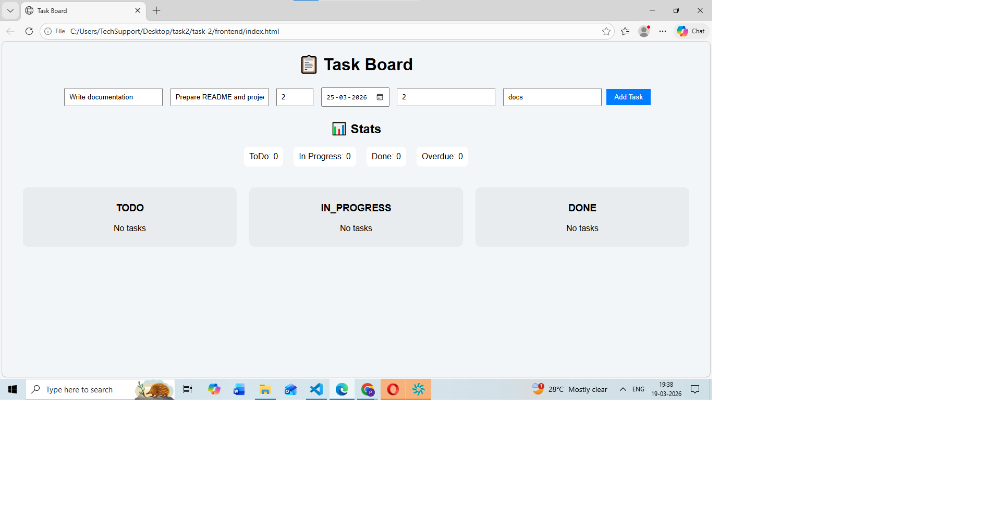
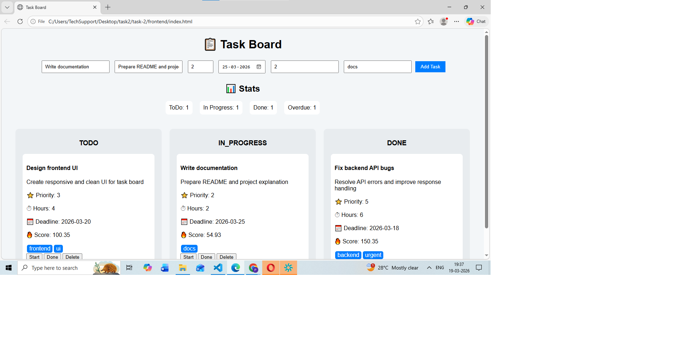
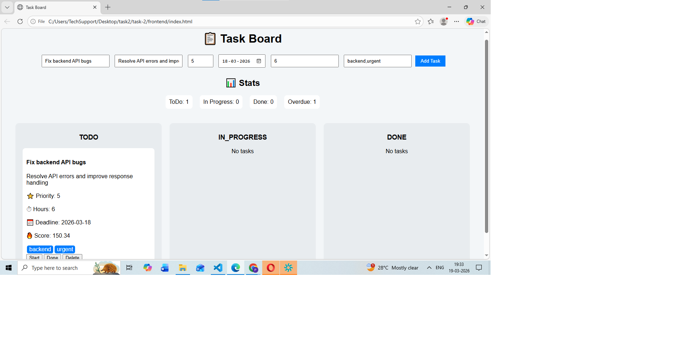
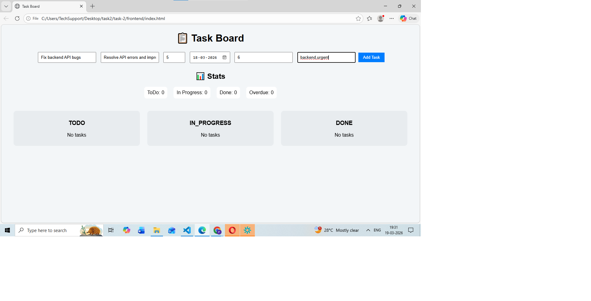
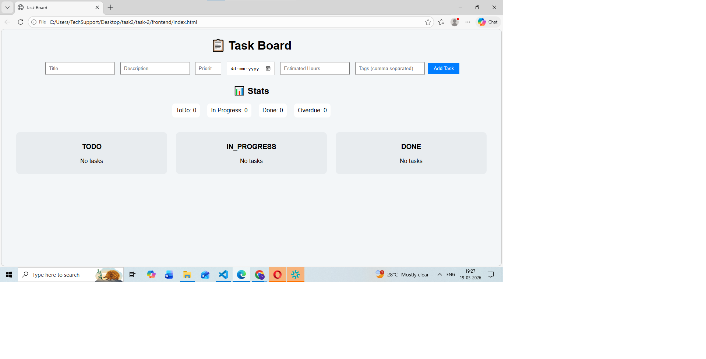

# 📋 Task-2: REST API Task Board with Priority Queue Logic

## 🚀 Overview

This project is a full-stack Kanban-style task board built as part of the Automac Technologies Internship Assignment.

It allows users to:

* Create, update, and delete tasks
* Move tasks across different stages (To Do → In Progress → Done)
* Automatically sort tasks using a computed urgency score
* View real-time task statistics

---

## 🛠️ Tech Stack

### Backend

* Node.js
* Express.js
* SQLite (file-based database)
* Raw SQL queries (no ORM)

### Frontend

* HTML
* CSS
* Vanilla JavaScript

---

## ⚙️ Setup Instructions

### 1️⃣ Clone the repository

```bash
git clone <your-repo-link>
cd task-2
```

---

### 2️⃣ Run Backend

```bash
cd backend
npm install
npm start
```

Server runs at:

```
http://localhost:5000
```

---

### 3️⃣ Run Frontend

Open:

```
frontend/index.html
```

OR use VS Code Live Server.

---

## 📌 Features Implemented

### ✅ Backend

* REST API with proper endpoints:

  * GET /tasks
  * POST /tasks
  * PUT /tasks/:id
  * DELETE /tasks/:id (soft delete)
  * GET /tasks/stats

* SQLite database with raw SQL queries

* Consistent API response format:

```json
{ "success": true, "data": ..., "error": null }
```

* Request logging middleware
* Input validation and error handling

---

### ✅ Priority Queue Logic

Tasks are sorted using:

```
urgencyScore = (priority × 20) + deadlineFactor + ageFactor
```

#### deadlineFactor:

* Overdue → +50
* Due within 24 hours → +40
* Due within 72 hours → +25
* Otherwise → max(0, 20 - daysUntilDeadline)

#### ageFactor:

```
ageFactor = min(15, daysSinceCreation × 1.5)
```

Sorting is performed **server-side** within each column.

---

### ✅ Frontend

* Kanban board UI (To Do, In Progress, Done)

* Create, update, and delete tasks

* Displays:

  * Priority
  * Deadline
  * Estimated Hours
  * Tags
  * Urgency Score

* Stats dashboard:

  * Count by status
  * Overdue tasks
  * Average urgency score

* UI States:

  * Loading state
  * Empty state
  * Error handling

---

## 🧠 Architecture Decisions

* Used SQLite for simplicity and easy setup
* Implemented raw SQL to meet assignment requirements
* Server-side sorting ensures consistent priority handling
* Separated backend and frontend for clean structure

---

## ⚠️ Assumptions

* If priority is not provided, default is considered as 1
* Tags are stored as JSON string in database
* Deadline is optional

---

## 🚧 Challenges Faced

### 1. Urgency Score Calculation

Implementing correct logic for deadline and age-based scoring required careful handling of date calculations.

### 2. Server-side Sorting

Ensuring tasks are grouped and sorted correctly within each status column.

### 3. Data Handling

Managing tags as arrays and storing them in SQLite as JSON.

---

## 📸 Screenshots

### Task Board


### Task Details


### Stats Dashboard


### Task Form


### Empty State


## 🎯 Conclusion

This project demonstrates:

* Full-stack development skills
* API design and implementation
* Problem-solving with priority-based sorting logic
* Clean and maintainable code structure

---
